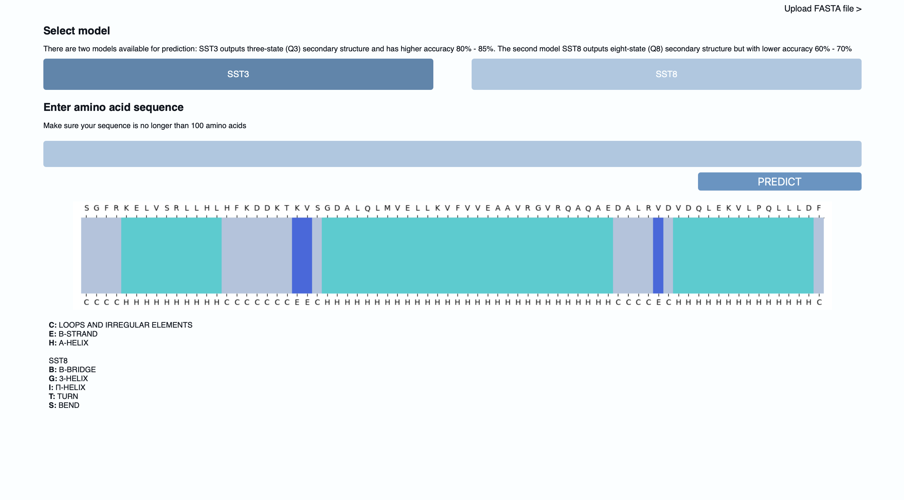

The aim of the project was to create a simple app that will return predicted proteins structures based on the sequences. 
Starting with some tests documented in notebooks in the Notebooks folder, and testing different variants to see how various model architectures perform. The best model was selected based on the highest character-level accuracy, and it was integrated into the app.

## Dataset

The dataset used for model training was downloaded from Kaggle.com: https://www.kaggle.com/datasets/alfrandom/protein-secondary-structure/ (Database: Open Database, Contents: Database Contents)
Cleaned data file was used to simplify the process on the initial stage of the project. 
The dataset consists of over 300000 samples of polypeptide chains. For the model development shorter sequences were selected (up to 100 amino acids). For the X variable amino acid sequences were used, while for y, the three-state (Q3) secondary structure was chosen. Later in the development process, a model was also trained based on the eight-state (Q8) structure. The results for Q8 were lower, however, the best model from this stage was still saved for later predictions. With more computational power, it would probably be beneficial to use SST8 along with longer sequences or the entire dataset. To prevent data leakage, sequences were deduplicated, removing multiple identical chains from the same proteins and potentially some short identical sequences as well.

## Model

Experiments tested encoder-decoder architecture, interpreting the task as a seq2seq problem. However, the results were not as promising, because the input-output pairs do not have variable length as in typical NLP translation problem. As a result, this property of seq2seq models was not beneficial in this case. Training an effective network this way would likely require more resources than necessary.

The encoder-decoder model was based on PyTorch seq2seq tutorial (https://pytorch.org/tutorials/intermediate/seq2seq_translation_tutorial.html), with some modifications in the structure as well as in the training process.
In addition bidirectional network was used as it often achieves better results, and different dimensions and hyperparameters were tested. However, the task itself was more similar to sequence labeling, with both inputs having the same length, because of this, a simpler architecture with only one recurrent unit was chosen.

In later experiments simple LSTM model was tested with hyperparameters and different training processes - normal training and also using dynamic padding (padding the sequence only to maximal length in the batch, not entire dataset), with the aim of minimising the effect of excessive padding with short sequences. The final results were slightly lower than with the normal training so the simple LSTM was saved and used as the final model for the project. 

The two best models achieved the highest result for predicting: 
- three-state (Q3) secondary structure with the accuracy 80% - 85%. 
- eight-state (Q8) secondary structure with accuracy 65% - 70%

## App

Simple Flask app was build for a graphical interface, enabling users to use models for predictions without writing Python code. The app has 2 main functionalities: 
- prediction of the secondary structure directly from the sequence provided by the user (takes the user input and makes prediction based on a single sequence, returns a graphical representation of sequence and structure)
- prediction of the secondary structure from FASTA file provided by the user. User can upload FASTA file and model makes predictions for all sequences in the file. This option returns predictions in the text field, from where they can be copied to the user's file, the output has the structure of FASTA file where each sequence begins with ">" and description of the sequence, followed by amino acid sequence and in the next separate line secondary structure prediction.

User can also select the model they want to use for prediction whether they prefer more accurate SST3 model or more complex but less accurate SST8 model.

All options have a maximum sequence length limitation of 100 amino acids (excessive sequences are being cut nad not used for predictions).

*The project was developed for educational purpose only.*
*Some parts of notebooks in this project were based on or inspired by the PyTorch Tutorials*

*DISCLAIMER: This code and analysis are provided "as-is" without warranty of any kind, either express or implied, including but not limited to the warranties of merchantability, fitness for a particular purpose, or non-infringement. The author makes no representations regarding the accuracy, completeness, or validity of any data, analysis, or conclusions contained herein. The user acknowledges that they should verify any conclusions or results independently before making decisions based on this content. The author shall not be liable for any damages, including but not limited to direct, indirect, incidental, special, or consequential damages, or any loss of profit, data, or use, arising from the use or inability to use this code and analysis.*